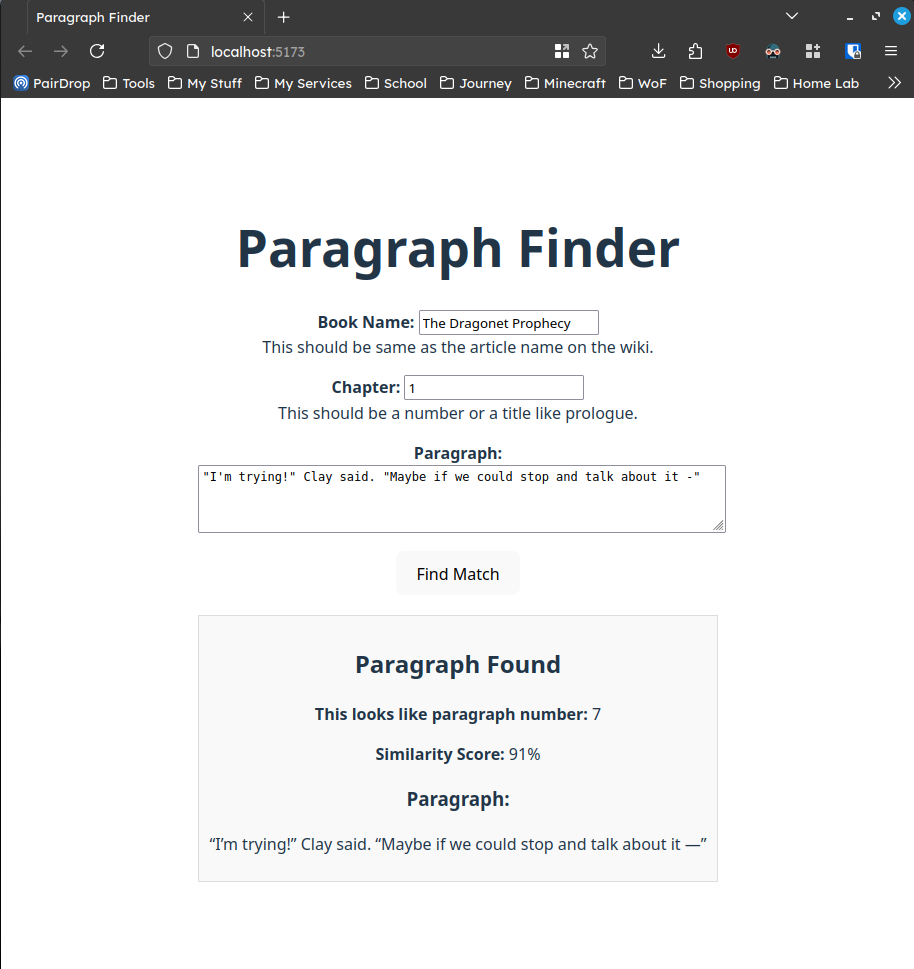

# Paragraph Finder WebUI

A web frontend for [Paragraph Finder](https://github.com/BogTheMudWing/Paragraph-Finder).

You can find a live demo on [Wings of Fire Wiki](https://wingsoffire.wiki/paragraphs).



## Use

### Prerequisites

- Npm

### Directions

1. Clone or download this repositiory.
2. Install packages.

```bash
npm install
```

You can start the development server for testing.

```bash
npm run dev
```

You can build the files to static HTML/CSS/JS to serve.

```bash
npm run build
```
